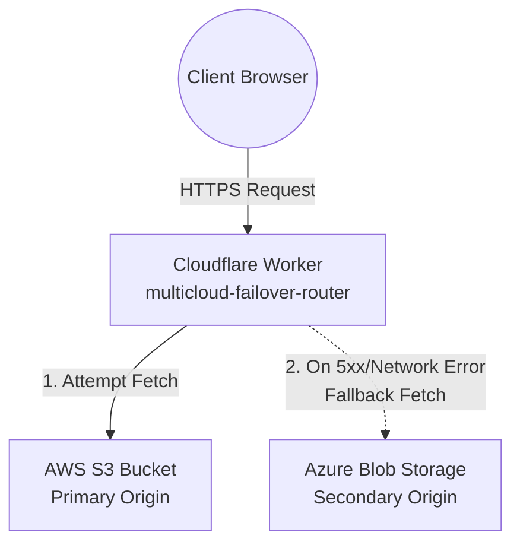

# Multi-Cloud Static Website

## Project Overview
This project implements a highly available, robust, and automated multi-cloud static website. It leverages leading cloud providers and a smart routing layer to achieve geographical redundancy and active failover mechanisms, ensuring the website remains online even during infrastructure outages.

> **Note:** The frontend application features a "Cloud Failover Simulator" UI widget. This widget is purely for demonstration purposes and simulates behavior visually. The **actual** physical infrastructure failover is fully implemented and handled invisibly at the routing layer via Cloudflare Workers.

## Objectives
- Deploy identical static website assets across multiple cloud storage origins.
- Implement an automated, secure CI/CD pipeline using GitHub Actions.
- Set up request-time failover routing that dynamically shields users from infrastructure downtime.
- Utilize the principle of least privilege for deployment security.

## Architecture
The infrastructure utilizes an Active-Passive multi-cloud deployment model:



## Technology Stack
- **Frontend:** HTML5, CSS3, Vanilla JavaScript
- **Primary Origin:** Amazon Web Services (S3)
- **Secondary Origin:** Microsoft Azure (Blob Storage $web)
- **Routing & Failover:** Cloudflare Workers
- **CI/CD Automation:** GitHub Actions
- **Infrastructure Management:** AWS CLI, Azure CLI, Wrangler (Cloudflare)

## Implementation Status

### ✅ IMPLEMENTED
- **AWS S3:** Configured as the primary public static website origin.
- **Azure Blob Storage:** Configured as the secondary static website fallback origin.
- **Cloudflare Worker:** Custom routing script dynamically handling 5xx errors and network exceptions.
- **GitHub Actions CI/CD:** Automated dual-cloud deployments on pushes to `master`.
- **Real Infrastructure Failover:** Verified active failover mechanisms.

### ❌ NOT IMPLEMENTED
- **GCP Cloud Storage:** Currently omitted due to billing requirements on the available GCP project. It is documented as a planned future extension.

## AWS Deployment
- **Role:** Primary static website origin
- **Bucket:** `multicloud-static-site-1790490640-406d7816`
- **Region:** `ap-south-1`
- **Endpoint:** [http://multicloud-static-site-1790490640-406d7816.s3-website.ap-south-1.amazonaws.com](http://multicloud-static-site-1790490640-406d7816.s3-website.ap-south-1.amazonaws.com)

## Azure Deployment
- **Role:** Secondary static website / failover origin
- **Storage Account:** `multicloudstatic8036366b`
- **Resource Group:** `multicloud-static-site-rg`
- **Container:** `$web`
- **Endpoint:** [http://multicloudstatic8036366b.z58.web.core.windows.net/](http://multicloudstatic8036366b.z58.web.core.windows.net/)

## Cloudflare Failover
- **Role:** Request-time DNS routing and high availability
- **Worker Name:** `multicloud-failover-router`
- **Logic:** 
  - AWS is attempted first.
  - Network/fetch errors and 5xx responses trigger Azure fallback.
  - Ordinary client errors (e.g., 404 Not Found) are returned directly to the client and do NOT trigger failover.
  - If both origins fail, a 503 Service Unavailable response is returned.
- **Endpoint:** [https://multicloud-failover-router.multicloud-yash.workers.dev/](https://multicloud-failover-router.multicloud-yash.workers.dev/)

## CI/CD Pipeline
Two separate GitHub Actions workflows monitor the `master` branch:
1. **GitHub Push → AWS Workflow → S3:** Synchronizes the frontend directory with the S3 bucket.
2. **GitHub Push → Azure Workflow → Blob $web:** Copies the frontend directory to the Azure storage account.

For detailed information, refer to [docs/cicd.md](docs/cicd.md).

## Security / Least Privilege
- **AWS:** Uses a dedicated IAM User restricted specifically to `s3:PutObject`, `s3:GetObject`, `s3:DeleteObject`, and `s3:ListBucket` strictly on the target bucket.
- **Azure:** Uses a dedicated Service Principal mapped to the `Storage Blob Data Contributor` role, scoped purely to the specific storage account.
- **GitHub Secrets:** All credentials are securely stored within GitHub Secrets. No credentials, access keys, or Service Principal secrets are committed to the repository.

## Failover Testing
The failover mechanism has been thoroughly tested by simulating an unresolvable primary origin at the Worker layer. The tests confirm seamless transition between clouds and reliable restoration. Details are available in [docs/failover-test.md](docs/failover-test.md).

## Project Structure
```
├── .github/
│   └── workflows/
│       ├── deploy-azure.yml      # Azure CI/CD pipeline
│       └── deploy.yml            # AWS CI/CD pipeline
├── assets/                       # Images and static assets
├── deployment/
│   └── router/                   # Cloudflare Worker code
│       ├── src/worker.js         # Failover routing logic
│       └── wrangler.toml         # Worker configuration
├── docs/                         # Extended documentation
├── index.html                    # Main website entry point
├── script.js                     # Frontend logic (simulation UI)
└── styles.css                    # Website styling
```

## Limitations
- Azure SSL certificates for generic static website endpoints take time to provision; HTTPS may present a certificate error temporarily, though HTTP works instantly.
- Cloudflare Workers free tier is rate-limited to 100k requests/day.

## Future Enhancements
- Integrate **GCP Cloud Storage** as a tertiary failover origin once billing is enabled.
- Add a custom domain (e.g., `www.example.com`) registered through Cloudflare for end-to-end SSL termination.
- Implement origin health-check caching to prevent repeated failing requests to an offline origin.

## How to Run Locally
To test the frontend locally:
1. Clone the repository.
2. Serve the directory using any local web server (e.g., `python -m http.server 8000`).
3. Open `http://localhost:8000/index.html`.

## Verification Summary
- ✅ **AWS S3 Deployment:** Verified live.
- ✅ **Azure Blob Deployment:** Verified live.
- ✅ **Cloudflare Failover:** Verified via origin manipulation tests.
- ✅ **GitHub Actions CI/CD:** Verified by successful automated deployments to both clouds.
