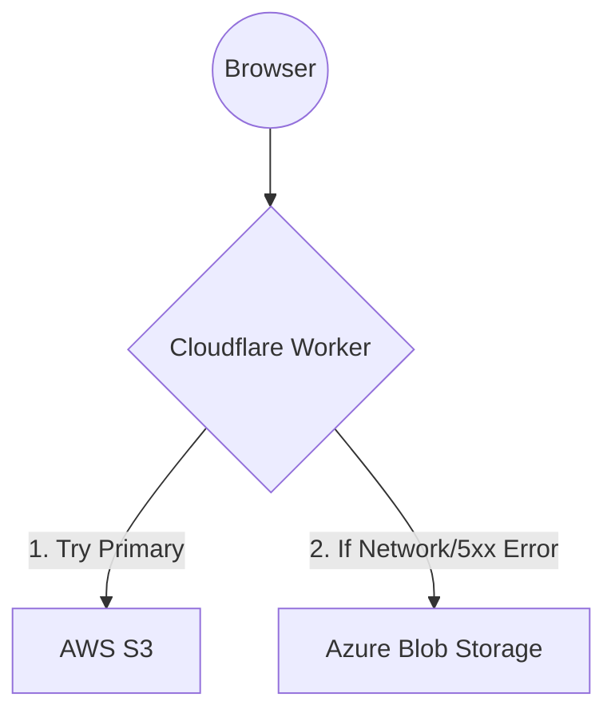

# Cloudflare Worker Failover Router

This directory contains the source code and configuration for the real request-time failover routing layer built using Cloudflare Workers. 

## Architecture
The Worker acts as a reverse proxy in front of our multi-cloud origin servers. It implements a passive, request-time failover strategy without relying on background health checks.



## Origins
1. **Primary Origin (AWS S3):**
   - URL: `http://multicloud-static-site-1790490640-406d7816.s3-website.ap-south-1.amazonaws.com`
2. **Secondary Origin (Azure Blob Storage):**
   - URL: `http://multicloudstatic8036366b.z58.web.core.windows.net`
   *(Using HTTP temporarily while the Azure static website SSL certificate propagates)*

## Routing Behavior & Failure Conditions
- **Normal Operations:** All requests (`/`, `/styles.css`, `/script.js`, `/assets/logo.svg`) are forwarded to the Primary Origin (AWS S3). The worker appends the `X-Served-By: aws-s3` header.
- **Genuine 4xx Errors:** If the primary origin returns a 4xx error (e.g. 404 Not Found), the worker passes this error back to the client. It does **not** fail over. This prevents a missing file on AWS from unnecessarily thrashing the Azure origin.
- **Failover Condition:** If the `fetch()` to the primary origin throws a network error (e.g. DNS failure, connection refused) OR if the origin responds with a 5xx HTTP Server Error, the worker catches the error and immediately attempts the identical request against the Secondary Origin (Azure).
- **Failover Response:** When served from the secondary origin, the response headers include `X-Served-By: azure-blob` and `X-Failover: true`.
- **Total Outage:** If both AWS and Azure origins fail, the worker returns a gracefully degraded `503 Service Unavailable` HTML response.

## Observability Headers
The router injects custom HTTP headers into responses to help debug and trace traffic:
- `X-Router: multicloud-failover`
- `X-Router-Timestamp: <iso-date-string>`
- `X-Served-By: <aws-s3 | azure-blob | none>`
- `X-Origin: <origin-url>`
- `X-Failover: true` (Only present if failover occurred)

## Testing the Router
To verify routing behavior:

1. **Test Normal Traffic:**
   ```bash
   curl -s -I https://multicloud-failover-router.multicloud-yash.workers.dev/
   ```
   *Expected header:* `x-served-by: aws-s3`

2. **Test Failover:**
   To safely simulate an AWS failure without destroying the S3 bucket, edit `wrangler.toml` and change `AWS_ORIGIN` to a non-existent URL (e.g., `http://this-origin-does-not-exist.amazonaws.com`).
   Deploy the change:
   ```bash
   npx wrangler deploy
   ```
   Make a request:
   ```bash
   curl -s -I https://multicloud-failover-router.multicloud-yash.workers.dev/
   ```
   *Expected headers:* `x-served-by: azure-blob` and `x-failover: true`

3. **Restore Normal Operations:**
   Revert `AWS_ORIGIN` back to the correct S3 endpoint and run `npx wrangler deploy`.

## Security Considerations
- **Environment Variables:** Origin URLs are injected via `wrangler.toml` `[vars]`. No sensitive credentials (API tokens, AWS keys, etc.) are required in the worker code or configuration because the origins are configured as public static websites.
- **Header Sanitization:** The worker strips hop-by-hop headers and Cloudflare-specific internal headers before forwarding the request to the origins to prevent spoofing or request smuggling issues.
