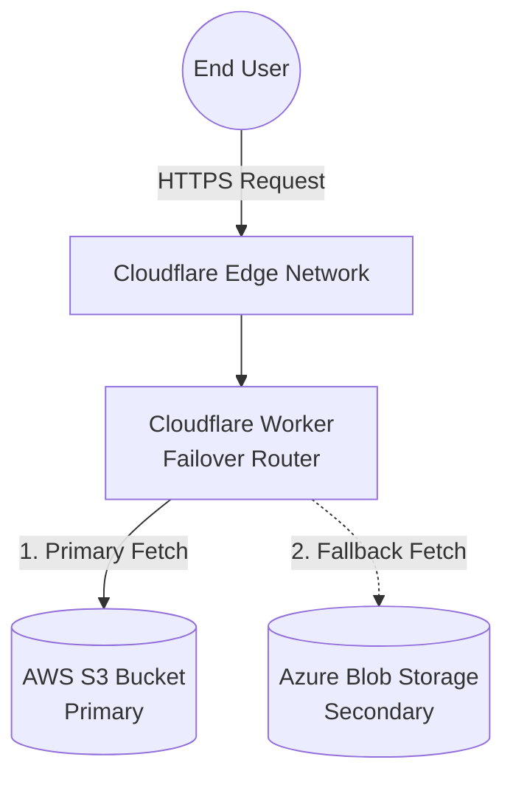
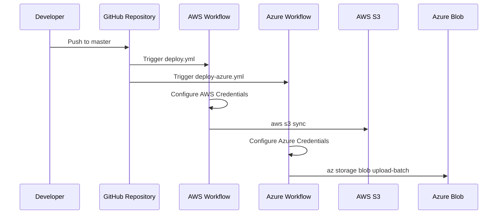

# Multi-Cloud Architecture

## Logical Architecture
The architecture is designed to eliminate single points of failure at the cloud provider level. By deploying the identical static website to two distinct major cloud providers (AWS and Azure) and routing traffic through an independent global edge network (Cloudflare), the system ensures high availability.

## Component Responsibilities

### 1. Cloudflare Edge (Worker)
- **Role:** Request Routing & Failover
- **Responsibility:** Intercepts all incoming client requests and routes them to the configured origins. It executes the failover logic directly at the edge, ensuring minimal latency penalty during a failure event.
- **Failover Logic:** Passive request-time detection. It attempts to fetch from AWS first. If the fetch throws a network exception or AWS returns a 5xx HTTP status code, it immediately catches the failure and fetches from Azure.

### 2. AWS S3
- **Role:** Primary Origin
- **Responsibility:** Hosts the static website files. Configured for static website hosting with public read access to the specific bucket contents.

### 3. Azure Blob Storage
- **Role:** Secondary / Fallback Origin
- **Responsibility:** Hosts an identical copy of the static website files in the `$web` container. Used only when AWS S3 is unreachable or impaired.

### 4. GitHub Actions
- **Role:** CI/CD Automation
- **Responsibility:** Automatically syncs the `master` branch codebase to both AWS S3 and Azure Blob Storage on every push, ensuring both origins serve identical, up-to-date content.

## Request Flow
1. A client initiates an HTTP request to the Cloudflare Worker URL.
2. The Cloudflare Worker modifies necessary headers and forwards the exact path to the primary origin (AWS).
3. If AWS returns a client-usable response (2xx, 3xx, 4xx), the Worker relays it directly to the client. Note that 4xx errors (like 404) are treated as legitimate client errors, not infrastructure failures.
4. If AWS fails (e.g., DNS error, connection timeout, or 503 Service Unavailable), the Worker catches the error and initiates a secondary fetch to Azure Blob Storage.
5. The Azure response is returned to the client, appended with an `X-Failover: true` header for observability.

## CI/CD Flow

## Failure Scenarios

| Scenario | System Reaction | Client Experience |
|----------|-----------------|-------------------|
| **AWS S3 Bucket Offline / Deleted** | Worker receives 404 (if configured as website) or network error. If network error, fails over to Azure. | Seamless (if network error) or 404 (if origin responds with 404). |
| **AWS Region Outage** | Worker fetch throws network error or 5xx. Fails over to Azure. | Seamless transition to Azure. |
| **Azure Storage Outage** | AWS continues to serve traffic normally. | Unaffected. |
| **Simultaneous Provider Outage** | Both origins fail. Worker returns custom 503. | "503 Service Unavailable" HTML page. |
| **Missing File (e.g., broken image)** | Both origins lack the file. Worker returns AWS's 404. | Standard 404 Not Found error. |
